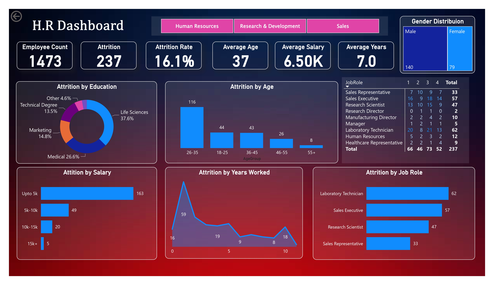

# HR Dashboard () - Power BI Projet

The goal of this project is to create a **power bi** dashboard to showcase the attrition data within the company.

## Requirements:
 - [**Company Data**](https://drive.google.com/drive/folders/18mQalCEyZypeV8TJeP3SME_R6qsCS2Og): Also avainlable in the repository.
 - [**Power BI**](https://www.microsoft.com/en-us/download/details.aspx?id=58494): For making the dashboard.
 - **Excel** (optional): To prepare & processes the data to analyze and eleminate a error and discrepencies in the data.

## Insperation/Credits:
 - **Youtube** - [Power BI Project End to End | Dashboard| Beginners | Complete Project - 2023](https://www.youtube.com/watch?v=j4xlVLgsmNQs) by [Rishab Mistra](https://www.youtube.com/@RishabhMishraOfficial)

## LICENCE
This project is licenced under **MIT**. For more info check out the [LICENCE](LICENCE)

## Author
 The author of the project is Ranit Saha a.k.a Coderooz(https://github.com/coderooz)
